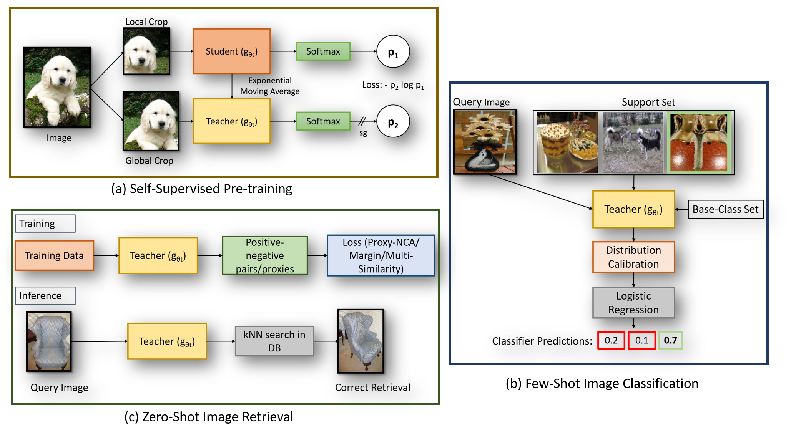
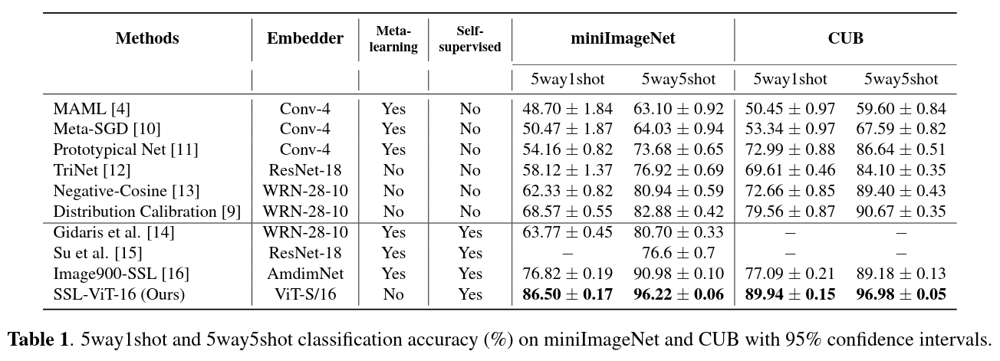
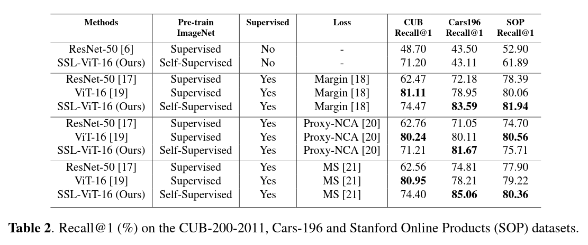

## Visual Representation Learning with Self-Supervised Attention for _Low-Label_ _High-Data_ Regime
Created by [Prarthana Bhattacharyya](https://ca.linkedin.com/in/prarthana-bhattacharyya-44582a79).

This repository contains PyTorch implementation for paper **Visual Representation Learning with Self-Supervised Attention for _Low-Label_ _High-Data_ Regime**.

Self-supervision has shown outstanding results for natural language processing, and more recently, for image recognition. Simultaneously, vision transformers and its variants have emerged as a promising and scalable alternative to convolutions on various computer vision tasks. In this paper, we are the first to question if self-supervised vision transformers (SSL-ViTs) can be adapted to two important computer vision tasks in the low-label, high-data regime: few-shot image classification and zero-shot image retrieval. The motivation is to reduce the number of manual annotations required to train a visual embedder, and to produce generalizable, semantically meaningful and robust embeddings. 

</br>

<div align="center">
    
</div>

## Results
- SSL-ViT + few-shot image classification:
<div align="center">
    
</div>

- Qualitative analysis for base-classes chosen by supervised CNN and SSL-ViT for few-shot distribution calibration:
<div align="center">
    
</div>

- SSL-ViT + zero-shot image retrieval:
<div align="center">
    
</div>

## Pretraining Self-Supervised ViT
- Run DINO with ViT-small network on a single node with 4 GPUs for 100 epochs with the following command. 
```bash
cd dino/
```
```python
python -m torch.distributed.launch --nproc_per_node=4 main_dino.py --arch vit_small --data_path /path/to/imagenet/train --output_dir /path/to/saving_dir
```
- For mini-ImageNet pretraining, we use the classes listed in: ```ssl-vit-fewshot/data/ImageNetSSLTrainingSplit_mini.txt```
For tiered-ImageNet pretraining, we use the classes listed in: ```ssl-vit-fewshot/data/ImageNetSSLTrainingSplit_tiered.txt```
- For CUB-200, Cars-196 and SOP, we use the pretrained model from:
```python
import torch
vits16 = torch.hub.load('facebookresearch/dino:main', 'dino_vits16')
```

## # Visual Representation Learning with Self-Supervised ViT for _Low-Label_ _High-Data_ Regime
### Dataset Preparation
Please follow the instruction in [FRN](https://github.com/Tsingularity/FRN) for few-shot image classification and [RevisitDML](https://github.com/Confusezius/Revisiting_Deep_Metric_Learning_PyTorch) for zero-shot image retrieval to download the datasets and put all the datasets in `data` folder.

### Training and Evaluation for few-shot image classification
- The first step is to extract features for base and novel classes using the pretrained SSL-ViT.
- ```get_dino_miniimagenet_feats.ipynb``` extracts SSL-ViT features for the base and novel classes.
- Change the hyper-parameter ```data_path``` to use CUB or tiered-ImageNet.
- The SSL-ViT checkpoints for the various datasets are provided below (Note: this has only been trained without labels). We also provide the extracted features which need to be stored in ```ssl-vit-fewshot/dino_features_data/```. 

<table> 
    <tr>
        <th>arch</th>
        <th>dataset</th>
        <th >download</th>
        <th >extracted-train</th>
        <th >extracted-test</th>
    </tr>
    <tr>
        <td>ViT-S/16</td>
        <td>mini-ImageNet</td>
        <td><a href="https://drive.google.com/file/d/1kXdqIR15fYKANx97blXVm8Fbwiz-FTvF/view?usp=sharing">mini_imagenet_checkpoint.pth</a></td>
        <td><a href="https://drive.google.com/file/d/1CcIF4NnDoAB12FCq4Q2Q0jrTxCk_wVfM/view?usp=sharing">train.p</a></td>
        <td><a href="https://drive.google.com/file/d/1KpQkdOwFr_jM-t4t-gA9cMPWGFuqyV2Y/view?usp=sharing">test.p</a></td>
    </tr>
    <tr>
        <td>ViT-S/16</td>
        <td>tiered-ImageNet</td>
        <td><a href="https://drive.google.com/file/d/1ObdJQozacGBcAmh8iWBrXv6dG6-OaC1i/view?usp=sharing">tiered_imagenet_checkpoint.pth</a></td>
        <td><a href="https://drive.google.com/file/d/1a7EdInD6JBWA3ppOWfhtVEBqNZWnq_13/view?usp=sharing">train.p</a></td>
        <td><a href="https://drive.google.com/file/d/13WAjvQAE3Lwtj83wvHLfVKYWvaw_90Q6/view?usp=sharing">test.p</a></td>
    </tr>
    <tr>
        <td>ViT-S/16</td>
        <td>CUB</td>
        <td><a href="https://dl.fbaipublicfiles.com/dino/dino_deitsmall16_pretrain/dino_deitsmall16_pretrain.pth">cub_checkpoint.pth</a></td>
        <td><a href="https://drive.google.com/file/d/1KfXbBCxDQ3CchFQVUSmTz2bjSfQKCmkW/view?usp=sharing">train.p</a></td>
        <td><a href="https://drive.google.com/file/d/1pU21XZ2r8cDkFhwWwEwNcRB1FIIREDC_/view?usp=sharing">test.p</a></td>
    </tr>
</table>    

- For _n_-way-_k_-shot evaluation, we provide ```miniimagenet_evaluate_dinoDC.ipynb```.  

### Training and Evaluation for zero-shot image retrieval
- To train the baseline CNN models, run the scripts in `DIML/scripts/baselines`. The checkpoints are saved in Training_Results folder. For example:
```bash
cd DIML/
CUDA_VISIBLE_DEVICES=0 ./script/baselines/cub_runs.sh
```
- To train the supervised ViT and self-supervised ViT:
```bash
cp -r ssl-vit-retrieval/architectures/* DIML/ssl-vit-retrieval/architectures/
```
```bash
CUDA_VISIBLE_DEVICES=0 ./script/baselines/cub_runs.sh --arch dino
```
- To test the models, first edit the checkpoint paths in `test_diml.py`, then run
```bash
CUDA_VISIBLE_DEVICES=0 ./scripts/diml/test_diml.sh cub200
```
<table> 
    <tr>
        <th>dataset</th>
        <th >Loss</th>
        <th >SSL-ViT-download</th>
    </tr>
    <tr>
        <td>CUB</td>
        <td>Margin</td>
        <td><a href="https://drive.google.com/file/d/1Vs4U3NwecDC3aD2mMYqc13qf608Nsay4/view?usp=sharing">cub_ssl-vit-margin.pth</a></td>
    </tr>
    <tr>
        <td>CUB</td>
        <td>Proxy-NCA</td>
        <td><a href="https://drive.google.com/file/d/1jAWMEqcu-XBHhlO6GN8qu3FoGF_-4rLT/view?usp=sharing">cub_ssl-vit-proxynca.pth</a></td>
    </tr>
    <tr>
        <td>CUB</td>
        <td>Multi-Similarity</td>
        <td><a href="https://drive.google.com/file/d/1DB6vW-BrbzX-QND9jeYjZDzMmQC_wPSG/view?usp=sharing">cub_ssl-vit-ms.pth</a></td>
    </tr>
    <tr>
        <td>Cars-196</td>
        <td>Margin</td>
        <td><a href="https://drive.google.com/file/d/1NLjXTVPkhTdtTPJ3_Npu-4R1BIH9YA2y/view?usp=sharing">cars_ssl-vit-margin.pth</a></td>
    </tr>
    <tr>
        <td>Cars-196</td>
        <td>Proxy-NCA</td>
        <td><a href="https://drive.google.com/file/d/1hHuiMHdyMKxMA_eW248AOyxppqoH0mNE/view?usp=sharing">cars_ssl-vit-proxynca.pth</a></td>
    </tr>
    <tr>
        <td>Cars-196</td>
        <td>Multi-Similarity</td>
        <td><a href="https://drive.google.com/file/d/1_BVKjBl1btYdEHHT_jHeIU0A25y9pkFW/view?usp=sharing">cars_ssl-vit-ms.pth</a></td>
    </tr>
</table>

## Acknowledgement
The code is based on:
- [DINO](https://github.com/facebookresearch/dino)
- [DC](https://github.com/ShuoYang-1998/Few_Shot_Distribution_Calibration)
- [DIML](https://github.com/wl-zhao/DIML)
